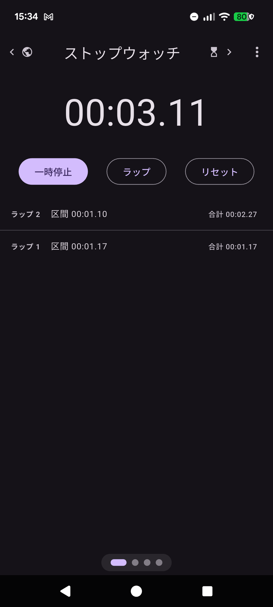
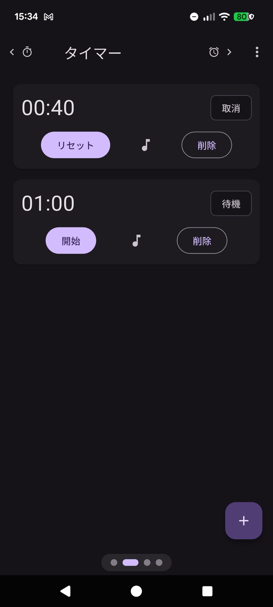
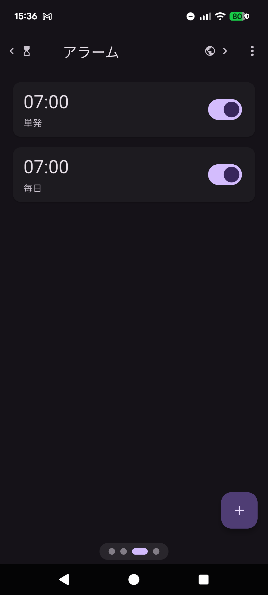
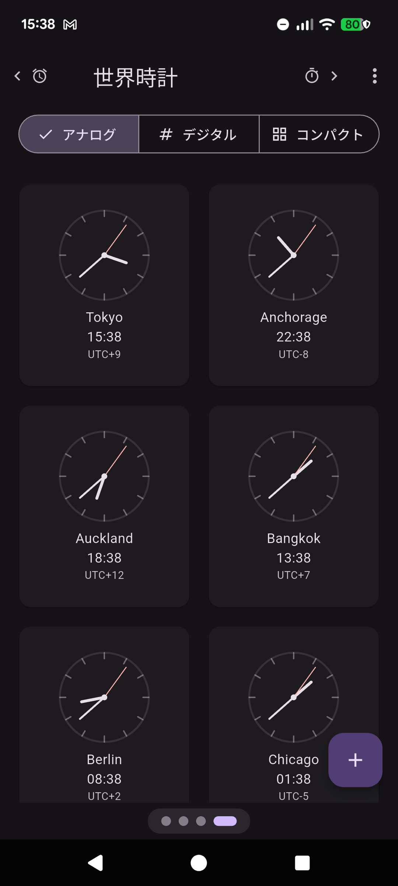

# TimerUtility

Flutter 製のストップウォッチ + タイマー + アラーム + 世界時計アプリ。Android 16 (API 36)
を主ターゲットとし、ロック画面上のアラーム表示 (FullScreenIntent) と複数タイマー同時稼働、
端末再起動後の復元に対応する。現在のリリースは **v1.1.5 (versionCode 9)**。

[](LICENSE)

---

## Screenshots

| Stopwatch | Timer | Alarm | World Clock |
| --- | --- | --- | --- |
|  |  |  |  |

---

## 主な機能

- **ストップウォッチ**: Lap 記録、ms 精度、`fake_async` で完全テスト可能な `Clock` 注入設計
- **複数タイマー**: 同時稼働上限 10 本、Drift で永続化、端末再起動後も復元
- **指定時刻アラーム**: 曜日繰り返し / once / スヌーズ (3/5/10 分)、Doze 回避のため
  Exact Alarm を利用。Exact を利用できない場合だけ inexact 予約へフォールバック
- **アラーム音**: 同梱 3 音源の試聴、端末内音源の取り込み、タイマー / アラーム /
  プリセットごとの音源選択に対応
- **アプリ音量**: 10〜100%で調整可能。Exact 経路では予約時刻から選択音源を Native
  Foreground Service でループ再生し、設定音量を適用
- **inexact 時の音声引き継ぎ**: OS の短い通知音から約 3.2 秒後に選択音源のループ再生へ移行
- **ロック画面アラーム鳴動**: `USE_FULL_SCREEN_INTENT` + `setShowWhenLocked` で
  ロック解除なしに鳴動画面を直接表示
- **音声停止**: ユーザーが有効化した場合のみ、端末内音声認識で鳴動を停止
- **世界時計**: 最大 6 都市、3 デザイン (PageView 切替)、初回の位置情報で現在地登録、
  拒否時は `FlutterTimezone` fallback
- **プリセット**: 一般 / 料理 / Pomodoro の 6 件 × 3 テンプレ、♪ ボタンで音源差替
- **多言語対応**: ja / en / zh-Hans (简体中文) / zh-Hant (繁體中文) / ko の 5 言語を
  公開ビルドに同梱。設定画面から手動切替、既定は OS ロケール追従
- **ダークモード**: `MaterialApp.darkTheme` + MD3 semantic role 化済
- **CVD (色覚多様性) 対応**: バナーに重大度ラベル `[重要]` / `[推奨]` / `[補助]` 併記
- **診断ログ**: 設定画面でトグル → JSON Lines をローテーション → zip で OS Share Sheet
  に渡せる Phase D 機構 (PII 排除済)

---

## What's special about this project?

このリポジトリは「機能で勝負するタイマーアプリ」ではなく、以下のリファレンス実装として
設計されている:

- Flutter で **Clean Architecture の Pure Dart 厳守 domain 層** を維持する実例
- Android 13 / 14 / 16 の **アラーム / 通知制約 (FullScreenIntent, SCHEDULE_EXACT_ALARM,
  POST_NOTIFICATIONS, audio channel 二重再生回避)** に対応した実装サンプル
- Claude Code (Anthropic) と協業する **AI 支援開発ワークフロー** の運用例
  ([CLAUDE.md](CLAUDE.md) / [BACKLOG.md](BACKLOG.md) / [docs/adr/](docs/adr/))

### What's special about this project? (English)

This isn't trying to be the next great timer app. It's:

- A worked example of **Clean Architecture in Flutter** with a strict Pure-Dart
  domain layer (no `package:flutter` imports, no `DateTime.now()`, no
  `Stopwatch` from `dart:core` — all time is injected via
  [`Clock`](docs/adr/0004-clock-injection-pattern.md))
- A reference for **Android 13/14/16 alarm constraints** — FullScreenIntent
  permission gating, exact-alarm permission flow, notification audio channel
  routing to avoid double-playback, lock-screen visibility via
  `setShowWhenLocked`, and boot-time timer restoration
- A test bed for **AI-assisted development workflow** with Claude Code (see
  [CLAUDE.md](CLAUDE.md), [BACKLOG.md](BACKLOG.md), [docs/adr/](docs/adr/) for the
  playbook)

If you are building an Android timer / alarm app and you hit weird issues with
notification audio, lock-screen behavior, or the Recent Apps button vanishing after
unlock, check the **"Phase 6 implementation retrospective"** notes in
[docs/android-constraints.md](docs/android-constraints.md).

---

## 技術スタック

- **言語 / フレームワーク**: Flutter (Dart SDK `^3.11.5`)
- **状態管理**: [Riverpod](https://riverpod.dev/) (`flutter_riverpod` 2.x +
  `riverpod_generator`)
- **ルーティング**: [go_router](https://pub.dev/packages/go_router) 14.x
- **永続化**: [Drift](https://drift.simonbinder.eu/) (SQLite、schemaVersion 5)
- **通知**:
  [`flutter_local_notifications`](https://pub.dev/packages/flutter_local_notifications)
  19.x
- **音声再生**: [`audioplayers`](https://pub.dev/packages/audioplayers) 6.x
- **権限**: [`permission_handler`](https://pub.dev/packages/permission_handler) 12.x +
  自前 `MethodChannel` (`io.github.bonkoturyu.timer_utility/permission`)
- **時刻**: [`clock`](https://pub.dev/packages/clock) (依存性注入) +
  [`timezone`](https://pub.dev/packages/timezone) +
  [`flutter_timezone`](https://pub.dev/packages/flutter_timezone)
- **テスト**: `flutter_test` + [`mocktail`](https://pub.dev/packages/mocktail) +
  [`fake_async`](https://pub.dev/packages/fake_async)

依存全件のライセンス内訳は [THIRD_PARTY_NOTICES.md](THIRD_PARTY_NOTICES.md) を参照。

---

## Build & Run

### 前提

- Dart SDK `^3.11.5` (`pubspec.yaml` の `environment.sdk` 制約)。`dart --version`
  または `flutter --version` の `Tools • Dart x.y.z` 行で 3.11.5 以上を確認。
  CI ([.github/workflows/ci.yml](.github/workflows/ci.yml)) は Flutter `3.44.8`
  (Dart 3.12.2 同梱) を使用
- Android SDK Platform 36 (Android 16) + build-tools
- JDK 17

### セットアップ

```sh
git clone https://github.com/Bonkoturyu/TimerUtility.git
cd TimerUtility

# pre-commit hook (dart format チェック) を有効化
git config core.hooksPath tool/git-hooks

flutter pub get
dart run build_runner build --delete-conflicting-outputs
```

`build_runner` は freezed / riverpod_generator / drift_dev のコード生成に必要。
詳細は [tool/git-hooks/README.md](tool/git-hooks/README.md)。

### 実行 (Debug)

```sh
flutter run -d <device-id>
```

多言語 (ja / en / zh / zh-Hant / ko) は公開ビルドに同梱済みで、`--dart-define`
等の追加フラグは不要。設定画面の「言語」から手動切替できる。

### テスト + 静的解析

```sh
dart format .
flutter analyze --fatal-infos
flutter test
```

CI ([.github/workflows/ci.yml](.github/workflows/ci.yml)) と同じ Flutter 側チェックが
ローカルで走る。現在のテスト件数と最新の検証結果は [tasklist.md](tasklist.md) を参照。

### Release build (任意)

`android/key.properties` が存在する環境では upload keystore で署名し、存在しない場合は
ローカル検証用に debug 署名へフォールバックする。秘密鍵と実体の
`android/key.properties` はリポジトリへ含めない。

```sh
flutter build apk --release
# または
flutter build appbundle --release
```

---

## Architecture

レイヤー構造:

```text
Presentation → Application (Riverpod Notifier) → Domain ← Infrastructure
```

- **Domain** (`lib/domain/`): Pure Dart (`package:flutter` import 禁止 /
  `DateTime.now()` 禁止 / `Stopwatch` 禁止 / `Timer.periodic` 禁止)
- **Application** (`lib/application/`): Riverpod Notifier。ドメインオブジェクトの
  オーケストレーション
- **Infrastructure** (`lib/infrastructure/`): Drift / flutter_local_notifications /
  audioplayers / permission_handler 等への adapter (Domain `ports/` を実装)
- **Presentation** (`lib/presentation/`): Widget tree、`go_router` 配線

詳細ドキュメント:

| 内容 | 参照先 |
| --- | --- |
| レイヤー構造 / 命名規則 / ディレクトリ規約 | [docs/architecture.md](docs/architecture.md) |
| Entity / ValueObject 定義 | [docs/domain-model.md](docs/domain-model.md) |
| Riverpod Provider 一覧 | [docs/state-management.md](docs/state-management.md) |
| Android 16 制約 / Doze / FullScreenIntent | [docs/android-constraints.md](docs/android-constraints.md) |
| Native ↔ Flutter メッセージ仕様 | [docs/platform-channels.md](docs/platform-channels.md) |
| テスト戦略 / 自動化範囲 | [docs/testing-strategy.md](docs/testing-strategy.md) |
| 権限取得フロー | [docs/permissions.md](docs/permissions.md) |
| 同梱音源仕様 | [docs/assets-spec.md](docs/assets-spec.md) |
| 翻訳 (ja / en / zh-Hans / zh-Hant / ko) | [docs/translations.md](docs/translations.md) |
| 過去の意思決定 | [docs/adr/](docs/adr/) (ADR 0001〜0007) |

Phase 別タスク管理:

- [BACKLOG.md](BACKLOG.md) — Phase 0 〜 12 のロードマップ
- [tasklist.md](tasklist.md) — 短期タスク
- [docs/dev-log.md](docs/dev-log.md) — 完了 Phase の実装ログ
- [docs/oss-and-play-release-plan.md](docs/oss-and-play-release-plan.md) — OSS 公開 →
  Play Store 提出の Phase 11.8 / 11.9 / 11.10 計画

---

## Fork 時の `applicationId` 書換ガイド

本リポジトリの Android `applicationId` は `io.github.bonkoturyu.timer_utility` (作者の
GitHub ハンドルベースの reverse-domain)。fork してビルド・配布する場合は、以下を自分のドメインに置換すること:

| ファイル | 該当箇所 |
| --- | --- |
| [android/app/build.gradle.kts](android/app/build.gradle.kts) | `namespace` / `applicationId` |
| [android/app/src/main/kotlin/](android/app/src/main/kotlin/) | `MainActivity.kt` の `package` 宣言、ディレクトリ階層 |

[android/app/src/main/AndroidManifest.xml](android/app/src/main/AndroidManifest.xml)
の `<activity android:name=".MainActivity">` や `${applicationName}` プレースホルダは
`build.gradle.kts` の `namespace` 変更で自動追従するため、Manifest 側は基本的に編集
不要。自前 receiver / service も相対クラス名で宣言されているため、Kotlin の package と
ディレクトリ階層を揃えて変更すれば追従する。サードパーティ receiver のクラス名は変更しない。

自前 `MethodChannel` の prefix も衝突防止のため新しい reverse-domain に置換する。
対象は `/permission`、`/interval_notification`、`/storage`、`/native_alarm`、
`/on_device_speech`。詳細は [docs/platform-channels.md](docs/platform-channels.md)。

---

## Contributing

PR / Issue 歓迎。詳細は [CONTRIBUTING.md](CONTRIBUTING.md) を参照。
Code of Conduct は [CODE_OF_CONDUCT.md](CODE_OF_CONDUCT.md) (Contributor Covenant 2.1)。

---

## License

[MIT](LICENSE) — Copyright (c) 2026 BON

同梱音源 (Pixabay Content License) と全依存パッケージ (MIT / BSD 系) のライセンス内訳は
[THIRD_PARTY_NOTICES.md](THIRD_PARTY_NOTICES.md) および
[assets/sounds/LICENSES.md](assets/sounds/LICENSES.md) を参照。

---

## Privacy Policy

- [日本語](docs/privacy-policy.md)
- [English](docs/privacy-policy.en.md)
- [简体中文](docs/privacy-policy.zh-Hans.md)
- [繁體中文](docs/privacy-policy.zh-Hant.md)
- [한국어](docs/privacy-policy.ko.md)
